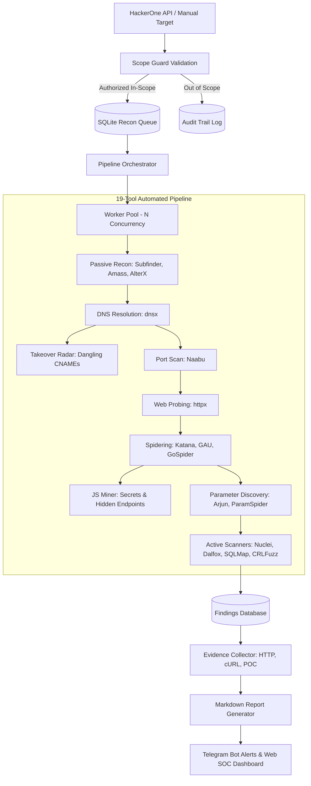

# 🏗️ BountyScope Architecture & Design Principles

This document describes the internal architecture, module boundaries, data pipeline, and extension points of BountyScope.

---

## 🏛️ High-Level System Design



---

## 🧱 Core Modules & Boundaries

| Module | Location | Purpose |
|---|---|---|
| **Core CLI & Config** | `src/cli.rs`, `src/config.rs` | Clap command-line parser, `.env` management, and runtime environment validation. |
| **Database & Persistence** | `src/database/` | High-concurrency SQLite database with WAL (Write-Ahead Logging), connection pooling, migrations, and repository queries. |
| **Scope Guard (V3)** | `src/scope/` | Non-bypassable policy gatekeeper checking domains, wildcards, CIDRs, forbidden paths, and request quotas. |
| **Attack Surface Graph (V3)** | `src/attack_surface/` | Petgraph-backed structural memory tracking hosts, endpoints, parameters, and object boundaries. |
| **Autonomous AI Agent (V3)** | `src/ai/` | Hypothesis-driven researcher executing Observe ➔ Hypothesize ➔ Test ➔ Validate loop with 3-layer memory. |
| **Finding Validator & Evidence (V3)** | `src/security/` | Multi-stage reproduction engine, false-positive elimination, and redacted evidence bundles. |
| **Sandboxed Client & Kill Switch (V3)** | `src/sandbox/` | Rate-limited, budget-capped safe HTTP client with emergency kill switch. |
| **Report Generator & Approval (V3)** | `src/reporting/` | Bug bounty Markdown/JSON report compiler with mandatory Human Approval Gate. |
| **Tool Adapters** | `src/tools/` | Generic `SecurityTool` trait implementations wrapping external binaries with timeouts and stderr handling. |
| **Specialized Scanners** | `src/scanner/` | Pure Rust scanners: Takeover Radar, CORS misconfiguration, 403 header bypass, open redirect probes, and Nuclei wrapper. |
| **Reconnaissance Engine** | `src/recon/` | Subfinder, HTTPX, Katana, GAU, and regex-powered JS Miner. |
| **REST API Server** | `src/api/` | Axum HTTP server exposing JSON endpoints with CORS support for web dashboard integration. |
| **Telegram Service** | `src/telegram/` | Async polling bot with phone number verification, interactive control keyboard, and alerting broadcaster. |


---

## 🔄 The 19-Tool Pipeline Workflow

1. **Target Ingestion & Scope Validation:**
   - Target is checked against `ScopeGuard`. If valid, it is enqueued into `recon_jobs`.
2. **Subdomain Enumeration:**
   - `subfinder` extracts passive subdomains.
   - `alterx` generates intelligent permutations.
   - `dnsx` validates DNS resolution and extracts CNAMEs.
3. **Takeover & Port Discovery:**
   - `Takeover Radar` inspects dangling CNAME records against known vulnerable cloud services (AWS S3, GitHub Pages, Heroku, Azure, etc.).
   - `naabu` probes for active ports (80, 443, 8080, 8443, 8888, 3000, 5000...).
4. **Web Probing & Crawling:**
   - `httpx` identifies live web services, status codes, titles, and technologies.
   - `katana` and `gau` crawl endpoints, forms, and historical archive URLs.
   - `JS Miner` parses extracted JavaScript files to find hardcoded tokens and internal endpoints.
5. **Pattern Filtering & Vulnerability Probing:**
   - `gf_filter` classifies URLs into attack classes:
     - SQL Injection ➔ `sqlmap` (non-destructive detection mode).
     - XSS & Reflection ➔ `kxss` & `dalfox`.
     - CRLF Injection ➔ `crlfuzz`.
     - Parameter Discovery ➔ `arjun` & `paramspider`.
     - Directory Fuzzing ➔ `ffuf`.
     - CVE & Misconfigurations ➔ `nuclei` with surgical templates.
6. **Triage & Evidence Capture:**
   - Every confirmed finding saves raw HTTP requests, raw responses, and reproducible `curl` commands into the `evidence` table.
   - A complete Markdown report ready for submission is formatted and stored in `/reports/`.
   - Real-time alerts are sent to the Telegram bot and the Web SOC Dashboard.

---

## 🧩 How to Add a New Tool Adapter

All external tools implement the `SecurityTool` trait defined in `src/tools/adapter.rs`:

```rust
#[async_trait]
pub trait SecurityTool: Send + Sync {
    /// Returns the unique name of the tool (e.g., "mytool")
    fn name(&self) -> &'static str;

    /// Checks if the tool binary is installed and executable
    async fn is_available(&self) -> bool;

    /// Executes the tool against the given target
    async fn execute(&self, target: &str) -> Result<ToolExecutionResult>;
}
```

### Steps to implement:
1. Create a new file in `src/tools/mytool.rs`.
2. Implement the `SecurityTool` trait using `ToolExecutor::run_command()`.
3. Register the new tool in `src/tools/mod.rs`.
4. Integrate the tool into the pipeline in `src/pipeline/worker.rs`.
5. Add a unit test in `tests/tools_tests.rs`.
